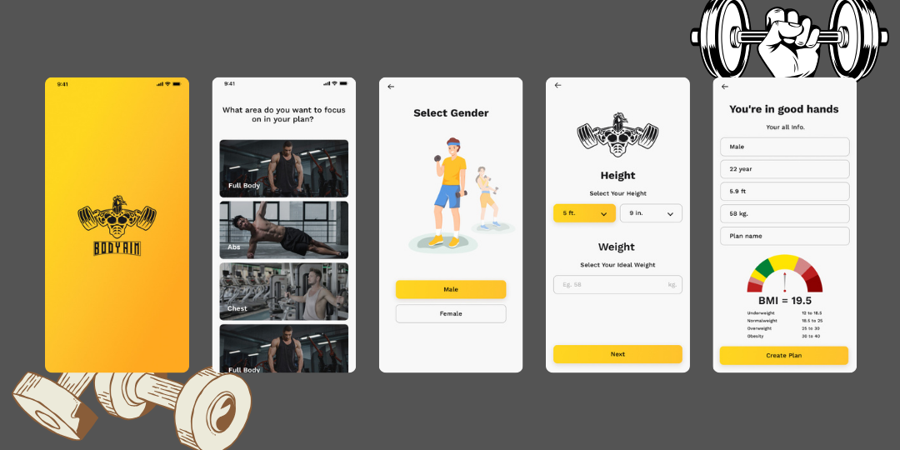
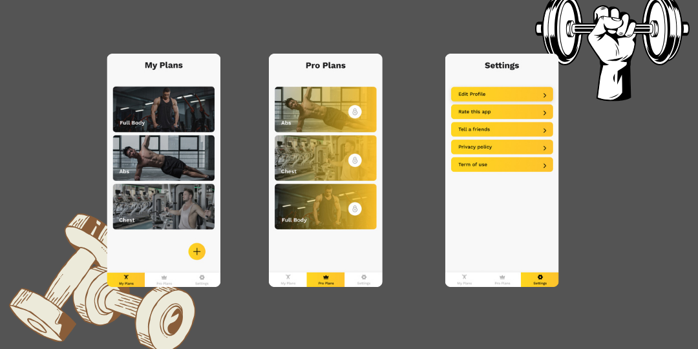
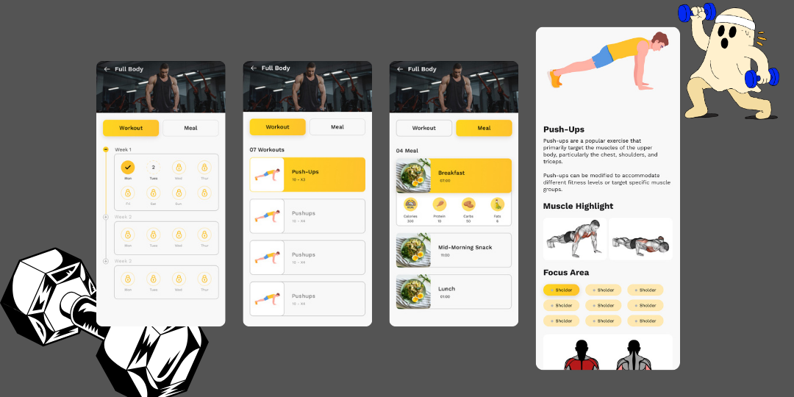

# Body Aim – Fitness & Nutrition Planning App

Body Aim is a mobile fitness application designed to help users calculate their BMI and generate personalized 12-week workout and meal plans. The app provides daily exercise routines, meal guidance, BMI-based planning, and animated workout demonstrations using Lottie animations.

This project was created to strengthen practical skills in mobile app development, database design, user-focused UI/UX, and data-driven fitness planning.

---

## Project Description

Body Aim allows users to enter basic health information such as gender, age, height, and weight. Based on this data, the app calculates BMI and creates a customized fitness plan. The plan includes structured weekly workouts, meal suggestions, and progress-focused routines for a complete 3-month fitness journey.

The application also includes free and pro plan sections, workout details, meal breakdowns, BMI results, and a clean yellow-themed interface designed for a modern fitness experience.

---

## Key Features

- BMI calculation based on height, weight, gender, and age
- Personalized 12-week fitness plan generation
- Daily workout routines
- Meal planning support
- Lottie-based exercise animations
- Free and premium plan sections
- User profile and settings screens
- Relational database structure for managing users, plans, meals, workouts, and progress
- Clean mobile UI with yellow fitness branding

---

## Screenshots

### App Onboarding & BMI Flow

### Plans & Settings Screens

### Workout, Meal & Exercise Detail Screens

---

## Project Status

This project is currently available as a GitHub portfolio project and is intended to demonstrate mobile app development, UI design, database structuring, and personalized fitness planning logic.
